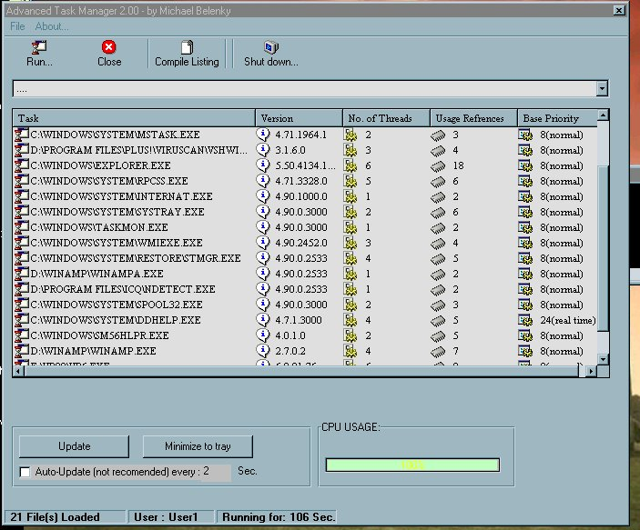



## Advanced Task Manager2

### Description

This is a Task Manager / viewer which shows all currently running procceses, and all open

windows, as well as CPU usage. you can also force windows(not processes) to close.

It also had a listing option which creates a text report of all currently running apps and windows, this is good for Spy apps and stuff.

This is a fixed version of this app, if it still won't work on your pc, erase all the CPU

usage code which seems to cause trouble on some versions of windows.

Please vote!
 
### More Info
 

             |
---                |---
**Submitted On**   |2000-09-01 14:28:46
**By**             |[ShookyN@GAR](https://github.com/Planet-Source-Code/PSCIndex/blob/master/ByAuthor/shookyn-gar.md)
**Level**          |Advanced
**User Rating**    |3.8 (34 globes from 9 users)
**Compatibility**  |VB 6\.0
**Category**       |[Windows System Services](https://github.com/Planet-Source-Code/PSCIndex/blob/master/ByCategory/windows-system-services__1-35.md)
**World**          |[Visual Basic](https://github.com/Planet-Source-Code/PSCIndex/blob/master/ByWorld/visual-basic.md)
**Archive File**   |[CODE\_UPLOAD14393212001\.zip](https://github.com/Planet-Source-Code/shookyn-gar-advanced-task-manager2__1-14899/archive/master.zip)

